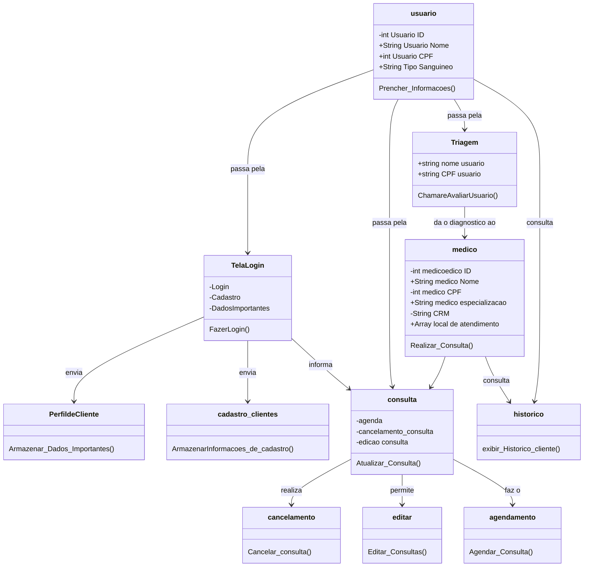

# Relatório Técnico - Entrega Parcial

**Data:** 13/05/2025
**Versão:** 1.0
**Equipe:**

- [Daniel Oliveira Farias] - [Desenvolvedor]
- [Emanuel Souza] - [Scrum master]
- [Gabriel de Freitas] - [P.O]
- [Gabriel Erick] - [Desenvolvedor]
- [João Vitor Rossi] - [Vice scrum master]
- [Victor Rodrigues] - [Desenvolvedor]
  

## 1. Resumo Executivo

-Atualmente no nosso projeto estamos realizando a prototipação, um grande passo que demos no projeto foi o diagrama de classes e finalizar as historias de usuário.

## 2. Introdução

### 2.1 Objetivo do Projeto

-O obetivo do projeto seria realizar um atendimento online para substituir a recepção do hospital, assim vendo qual o grau de prioridade do paciente e gerando uma senha para a triagem.

### 2.2 Escopo

-O foco do nosso projeto e ser utilizado por qualquer tipo de pessoa pois ele será auto explicativo, para auxiliar e agilizar o atendimento que seria feito na recepção.

### 2.3 Metodologia

-No nosso projeto estamos utilizando a Metodologia ágil, para tornar nosso desenvolvimento mais eficiente e objetivo, para isso, dividimos nossa organização em sprints e atividades para cada membro do grupo, onde o foco é de forma rapida e ágil entregarmos semanalmente avanços no projeto.

## 3. Análise de Requisitos

### 3.1 Requisitos Funcionais

- Eu como Stackeholder quero que o sistema possua um banco de dados que suporte mais 1.000 usuários para que a maior parte de pessoas consiga se registrar.
- Eu como desenvolvedor quero que as senhas dos usuário sejam criptografadas com tecnologia bcrypt para proteger as informações dos usuários.
- Eu como paciente quero que o sistema esteja disponivel 24 horas por dia para que eu consiga ter acesso a ele sempre que necessário.
- Eu como paciente quero que as informações do sistema se conectem com as do P.A.
- Eu como paciente quero visualizar a fila de espera no hospital.
- Eu como paciente quero ter uma confirmação imediata de que deu certo meu atendimento.
- Eu como paciente quero uma interface de aplicativo em que eu possa tomar decisões em uma tela com poucos botões e poucos textos para que eu não me perca.
- Eu como paciente quero cadastrar minhas informações logo quando instalo o app.
- Eu como paciente quero registrar a minha entrada no upa com o widget.
- Eu como usuário idoso quero usar o sistema por voz.
- Eu como usuário idoso quero botões que tenham ícones que mostram a funcionalidade do botão.
- Eu como paciente quero agendar meu atendimento pelo celular antes de chegar lá.

### 3.2 Requisitos Não Funcionais

-Eu como paciente quero que o sistema esteja disponivel 24 horas por dia para que eu consiga ter acesso a ele sempre que necessário.
-Eu como paciente quero que a transição de telas seja até 2 segundos para reduzir o máximo possível o tempo do meu atendimento.
-Eu como desenvolvedor quero que as senhas dos usuário sejam criptografadas com tecnologia bcrypt para proteger as informações dos usuários.
-Eu como Stackeholder quero que o sistema possua um banco de dados que suporte mais 1.000 usuários para que a maior parte de pessoas consiga se registrar.

### 3.3 Matriz de Rastreabilidade

[Resumo ou referência à matriz de rastreabilidade]

## 4. Arquitetura e Design

- Design responsivo

### 4.1 Visão Geral da Arquitetura

- Front-end (interfaces do usuário)
- Back-end (lógica do sistema)
- APIs (para expansão do sistema para versão mobile)
- Banco de Dados 
- Segurança e Autenticação (camada para realizar a proteção dos dados e autenticação do usuário)

### 4.2 Diagramas
-[diagrama de dados](diagrama_dados.md)
-[fluxo BPNM](fluxo_BPNM.md)

#### 4.2.3 Classes

### 4.3 Decisões de Design

-Interface simples
Optamos por um visual limpo, com poucos botões e linguagem clara, como “Agendar Consulta” ou “Fazer Check-in”. Assim, o paciente entende logo o que fazer.

-Acessível para todos
Pensamos na acessibilidade com contraste de cores, letras grandes, ícones e suporte para leitores de tela, pensando especialmente em idosos e pessoas com deficiência.

-Funciona em vários dispositivos
O sistema pode ser usado nos totens do hospital ou no celular e computador, facilitando o acesso mesmo antes de chegar ao hospital.

-Integração com o sistema do hospital
Tudo que o paciente preenche vai direto para o sistema interno, agilizando o atendimento e evitando retrabalho.

-Menos fila, mais agilidade
Com esse sistema, o paciente resolve boa parte do processo sozinho, o que ajuda a diminuir as filas e o tempo de espera.

### 4.4 Protótipos

- Desenvolvemos protótipos das telas de cadastro, login e home para desktops e celulares na plataforma FIGMA.

## 5. Implementação Atual

### 5.1 Funcionalidades Implementadas

Ainda não foram implementadas funcionalidades no sistema.

### 5.2 Tecnologias Utilizadas

- MERMAID, DRAW.IO, JIRA, FIGMA, MIRO, GITHUB.

### 5.3 Código-fonte

(https://github.com/Gabriel-erk/auto_atendimento_1A)

## 6. Testes

### 6.1 Abordagem de Teste

- iremos validar o sistema testando os requisitos funcionais e não funcionais para verificar se atendem aos objetivos.

### 6.2 Testes Realizados

- comparamos os requisitos com os objetivos do sistema, realizando alteração constante.

### 6.3 Resultados

- alteramos inconsistências e acrescentamos novas ideias.

## 7. Progresso do Projeto

### 7.1 Cronograma

- Em relação ao ccronograma planejado, apenas não conseguimos realizar a completa prototipação até o momento.

### 7.2 Sprints Concluídas

- Sprint 1: realizamos a montagem do backlog, criamos histórias de usuário documentando requisitos funcionais, não funcionais e diagramas.

### 7.3 Métricas

- Disponibilidade: O sistema deve estar disponível 99,9% do tempo.
- Escalabilidade: O sistema deve ser capaz de suportar 1.000 usuários simultaneamente.
- Segurança: O sistema deve bloquear qualquer tentativa de login após 5 tentativas.

## 8. Desafios e Soluções

- 

### 8.1 Principais Desafios

-Os principais desafios encontrados até o momento foi a usabilidade do jira, uso do github e divisão de tarefas.

### 8.2 Soluções Adotadas

-As soluções que encontramos para resolver os nossos problemas foi reunir com o grupo para dividir as tarefas visando a dificuldade de cada um, e estudo das plataformas apresentadas como github e jira.

## 9. Próximos Passos

- Última análise de requisitos
- Realizar prototipação das telas
- Implementação do Sistema

### 9.1 Funcionalidades Planejadas

-O proximo objetivo no projeto é fazer as telas e integração com os sistemas internos dos hospitais.

### 9.2 Melhorias Previstas

-Melhorias de acessibilidade.
-Melhorias de design.
-melhorias de escalabilidades.

### 9.3 Cronograma Atualizado

-Programamos a finalização do projeto para o dia 06/06/2025

## 10. Lições Aprendidas

-Entendimento do funcionamento do "SOLID" na prática.
-Fizemos diagramas de classes usando codigo, que foi muito esclarecedor e objetivo.

## 11. Conclusão

-Podemos concluir parcialmente que temos pronto o diagrama de classes, historias de usuários e o github esta ajustado segundo os padrões implementados pelo professor.

## 12. Anexos

## 13. Protótipação 
### 13.1 O que é?
  O protótipo tem como propósito elaborar juntamente com o usuário as telas para o sistema e suas funcionalidades usando o Figma. Isso é muito util pois, se o usuário pedir alteração (que muito provavelmente vai acontecer) não será difícil fazer as alterações e acertar qual seria o ideal para o cliente, assim, tendo isso em mãos, será apenas reproduzir isso com os códigos e entregar o resultado ao cliente, enconomizando tempo e dinheiro. 

[Lista de anexos ou referências a documentos complementares]

>[!NOTE]
>Este relatório representa o estado do projeto na data da entrega parcial. Alterações e evoluções ocorrerão na segunda fase do desenvolvimento.
